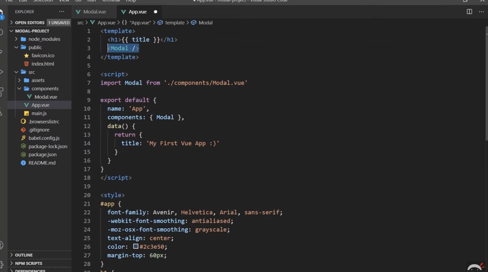
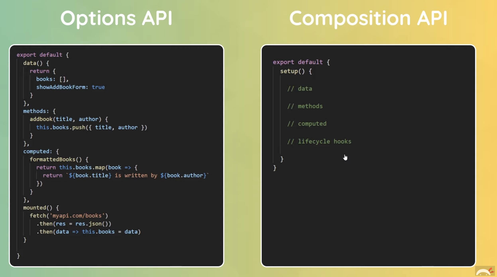
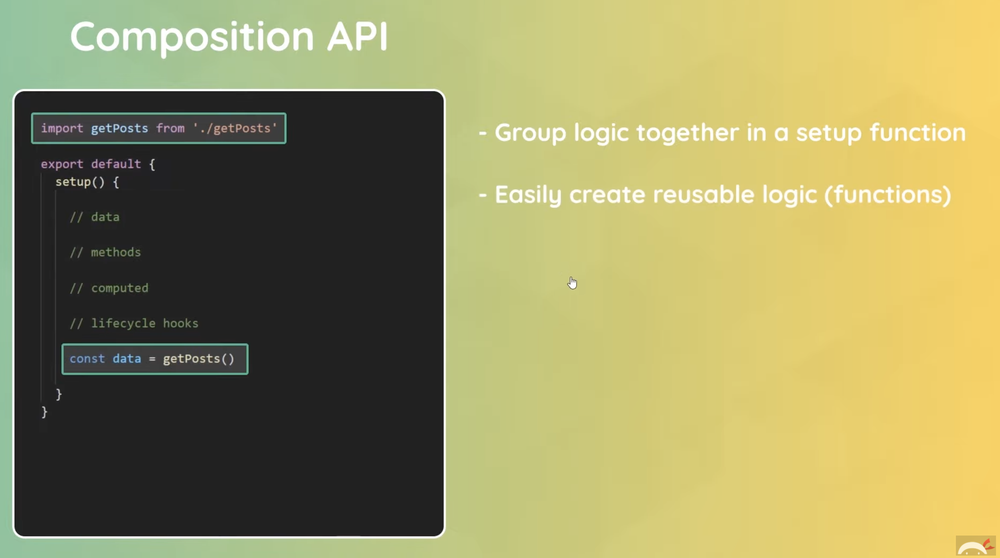

# vuenotes

Front-end frameworks aim to fix the following issues in front-end web development:

- Long development times
- Difficult bug fixes and updates
- Slow page rendering

The first thing you’ll need to do to begin using any front-end framework is to add the framework to your project. You can import Vue by adding a `<script>` tag inside the `<head>` of your project’s HTML file:

```
<script src="https://cdn.jsdelivr.net/npm/vue/dist/vue.js" defer></script>
<script src="https://cdn.jsdelivr.net/npm/vue@2/dist/vue.js"></script>

```

Above we load the current version of Vue, hosted by the Vue team, directly into your project. We use the defer attribute on the `<script>` tag to make sure that the page is loaded and ready to hook up to Vue before we actually load Vue.

Even at this preliminary step, the Vue team has found ways to shorten your development time. Many front-end frameworks, like React and Angular, have difficult setup processes that can make starting a project a hassle. The Vue team recognized that many complex front-end features aren’t useful until late in the front-end learning journey (or sometimes at all). As a result, they offered this simple alternative that provides most of Vue’s features to developers quickly and easily.

We now have access to the Vue library.


Vue makes it easy to make a new app by exporting a class called Vue. Much like any other JavaScript class, we create instances of this class using the `new` keyword. Each of these Vue instances is a fully-functioning Vue app. Let’s look at an example:

```
// app.js
const app = new Vue({});
```

By invoking the `Vue` class constructor with the new keyword, we create a new instance of the `Vue` class which we name `app.` 

The Vue constructor can set many properties on our Vue app when it is called. However, unlike many constructors, the Vue class does not take each of these properties as separate arguments. Rather, it only takes one argument.

 Vue constructor takes in one object as an argument, called the `options object`. Each piece of information the Vue app needs to function is added to the options object as a key-value pair. 

 vu3

 the compisition api

 setup() function
 teleport component 

 # if/else in html

 `v-if`
 `v-else`
 `v-show`


 # mouse event

 # for loops

 `v-for="books in book"`

 # dynamic attributes - attribute binding

 ``v-bind:href="url"`

(url would be a property in the vue object you could now access)

# binding attributes

To pass props we bind the attributed prop name 

shortcut for `v-bind` is `:attributename`

# dynamic classes

conditionally applying classes and applying styles dependent on that:

https://www.youtube.com/watch?v=CYPZBK8zUik&list=PL4cUxeGkcC9hYYGbV60Vq3IXYNfDk8At1&index=3

# importing components

</img>

# event modifiers

https://www.youtube.com/watch?v=KM1U6DqZf8M&list=PL4cUxeGkcC9hYYGbV60Vq3IXYNfDk8At1&index=5

`@click.self='element'`

# new vue3 features

composition API- similar to React Hooks

</img>
</img>

For larger projects which require a bit more organisation, more code reuse, and more complex logic- using the compisition api is better suited to accommodate these requirements.

